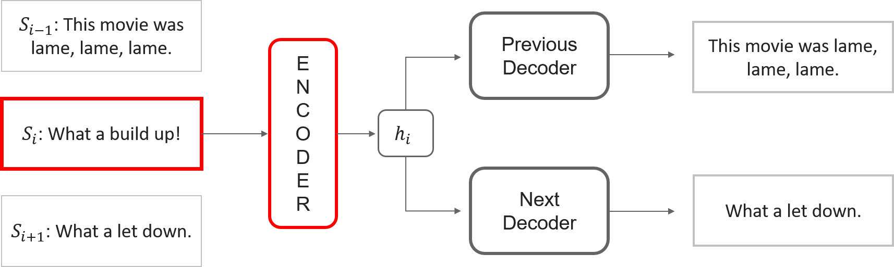

```{r setup, include=FALSE}
knitr::opts_chunk$set(echo = TRUE, fig.pos = "H", out.extra = "")
library(tidyverse)
library(data.table)
library(knitr)
library(kableExtra)
library(xfun)
library(latex2exp)
library(gridExtra)
``` 

```{r, include=FALSE}
options(tinytex.verbose = TRUE)
```

\newpage

```{=tex}
\newcounter{savepage}
\pagenumbering{Roman}
```
```{=tex}
\setcounter{tocdepth}{4}
\tableofcontents
```
\newpage

```{=tex}
\listoftables
```
```{=tex}
\listoffigures
```


\section*{Abbreviations}

```{r Abbreviations, echo=FALSE}
data.table(
  Term = c("Natural Language Processing", "Bag-of-words", "Term Frequency - Inverse Document Freuquency", "Continuous bag-of-words", "Paragraph Vector", "Paragraph Vector - Distributed Memory", "Paragraph Vectors - Distributed Bag-of-words", "Internet Movie Database", "Sentence-BERT"),
  Abbreviation = c("NLP", "BoW", "TF-IDF", "CBoW", "Doc2Vec","PV-DM", "PV-DBOW", "IMDB", "SBERT")) %>%
  arrange(Term) %>%
  kable(booktabs = TRUE, format =  "latex", escape = FALSE, linesep  = "") %>%
  kable_styling(latex_options = c("striped", "repeat_header"), full_width = TRUE)
```


\newpage


\setcounter{savepage}{\arabic{page}}

\pagenumbering{arabic}

# Introduction

Humans have many different ways to communicate with each other, for example by using gesture, facial expressions and also language. With human language, one can ask questions, give instructions or express feelings and it is one of the most complex tools used by humans (@pilehvar20). Natural Language Processing (NLP) describes methods and techniques for machine processing and understanding of natural, human language. This allows interactions between individuals and computers. 

NLP is a subfield of Artificial Intelligence as computers 'behave intelligent' by being able to process text or voice data and also understand its meaning. To achieve this, words or texts need to be mapped to numerical vector spaces, which is known as word and text embedding respectively. This enables machine learning models to process these embeddings and train them for specific tasks such as sentiment analysis, text classification or semantic relatedness.

There are several approaches to embed words, sentences, paragraphs and documents. First, bag-of-words models will be explained in Chapter \ref{bag-of-words-approach}. This method is an intuitive approach which is not based on neural networks. After that, neural network-based methods will be described. @mikolov13a proposed a popular word embedding method called Word2vec. It is able to capture the semantics and context of words and will be addressed shortly in chapter \ref{word2vec}. To move on from there, sentence and document embeddings are described, starting with Paragraph Vector (@mikolov14) in part \ref{paragraph-vector} which is based on Word2Vec. The last approach that is mentioned here, is the Skip-Thoughts model by (@skipThought) in section \ref{skip-thought-vectors}. It is specifically used for sentences and relies on an encoder-decoder framework. In chapter \ref{application-in-python}, the bag-of-words model and Paragraph Vector will be applied in Python. A sentiment analysis will be performed with reviews taken from the IMDB dataset by @imdb and its results will be compared in part \ref{evaluation}. For concluding, an outlook will be given in part \ref{outlook} to a current state-oft-the-art method called SBERT.


# Bag-of-words approach

To analyse texts with machine learning models, one needs to transform these written texts into numeric vectors. One intuitive way of achieving this, is the bag-of-words (BoW) approach. It is one way of representing sentences or documents by converting them into numeric vectors. The basic idea is that a vocabulary is learned which consists of the words in each text. A text can be a sentence, one or more paragraphs or documents. Therefore, one can think about this approach as a bag that contains the words which are used and so any information about grammar or the structure or order of words in the text is discarded. The model does not know where words are in the document, it only concerns itself with whether known words appear in the document.

Let $T$ contain $n$ texts, so $T = \{t_1, ..., t_n\}$. Each text $t_i \text{ mit } i = 1,..., n$ consists of certain words that form the vocabulary $v_i \text{ with } i = 1, ..., n$ of a text. The vocabularies of texts may differ in length which means that they can contain a different amount of words. The whole vocabulary therefore consists of unique words from all processed documents. A text can be represented by a vector, which has the same length as the vocabulary, that counts the number of times each word occurs in the respective document.


The following will present an example of a bag-of-words model: 

$$
\text{Text 1: "This movie was lame, lame, lame."}
$$
$$
\text{Text 2: "What a build up!"}
$$
$$
\text{Text 3: "What a let down."}
$$

In this example the vocabulary for Text 1 would be 
$$
v_1 = \{this,\ movie,\ was,\ lame\},
$$
while case and punctuation is being ignored here. The whole vocabulary $V$ for all three texts contains 12 words as it is formed from all unique words: 
$$
V = \{this,\ movie,\ was,\ lame,\ what,\ a,\ build,\ up,\ let,\ down\}.
$$

After specifying the vocabulary, one can transform the texts into vectors. As the size of the vocabulary is known in this example, a fixed-length text representation of 12 can be used. Every position in the vector stands for the number of times that a certain word occurs in a text. Table \ref{tab:bow} shows the vectorization of the texts 1, 2 and 3. Each row represents a text. The vector of Text 1 is for example [1, 1, 1, 3, 0, 0, 0, 0, 0, 0]. 


```{r bow, echo=FALSE, fig.cap="\\label{tab:bow}Number of times that each word appears in texts 1, 2 and 3.", fig.align='center'}
bow <- data.table( 
  Text = c(1, 2, 3),
  this = c(1, 0, 0),
  movie = c(1, 0, 0),
  was = c(1, 0, 0),
  lame = c(3, 0, 0),
  what = c(0, 1, 1),
  a = c(0, 1, 1),
  build = c(0, 1, 0),
  up = c(0, 1, 0),
  let = c(0, 0, 1),
  down = c(0, 0, 1)
) 
kbl(bow, booktabs = TRUE, format =  "latex", escape = FALSE, label = "bow", caption = "Example of bag-of-words model", linesep  = "", align = c("c")) %>%
  kable_styling(latex_options = c("striped"), full_width = FALSE)
```

That is the general idea of bag-of-words models. An even more simple way of the BoW approach is to mark the presence of each word as a boolean value, using 0 for absent and 1 for present words. If one uses this method, the vector of the first text would change to [1, 1, 1, 1, 0, 0, 0, 0, 0, 0]. While the value of the word *lame* was set to *3* in the example demonstrated above, it is now *1* as the presence of a word is of interest and not the number of times it occurs in a text (@bow_website).


## N-grams

By using n-grams, one creates a vocabulary that contains grouped words. According to @bow_website, this changes the scope of the vocabulary and also allows the bag-of-words to capture a bit more meaning from a document. A n-gram is a n-token sequence of words. The vocabulary of a 2-gram, which is also called bigram, for the second text is $v_{2gram, 2} = \{what\ a,\ a\ build,\ build\ up\}$. In general, the $n$ in n-grams refers to the number of grouped words. As n-grams is a sequence of of $n$ words in a text, it captures the context in which words are used together. Once a n-gram is formed, the documents are represented as vectors analogue to bag-of-words.

## Term Frequency - Inverse Document Frequency

Term Frequency - Inverse Document Frequency (TF-IDF) is another approach in order to score the frequency of words that exist in a document. The BoW method counts the number of times each word appears in a document. Therefore, highly frequent words have a larger score although they may not be as interesting or important to the model as rarer but perhaps domain specific words (@bow_website). TF-IDF penalizes words that are frequent across all documents by rescaling the frequency of words.

Term Frequency (TF) is a measure of how many times a word $w$ appears in a text $t$:

$$
tf_{w, t} = \frac{n_{w, t}}{Number\ of\ words\ in\ the\ text}
$$
Here, $n$ is the number of times a word $w$ occurs in a text $t$.

Inverse Document Frequency (IDF) measures the importance of a word $w$: 

$$
idf_w = \log{\frac{number\ of\ texts}{number\ of\ texts\ with\ word\ 'w'}}
$$
The TF-IDF score can then be computed for each word in the vocabulary. The higher the score is, the more important is hence the word (@bow_website3):

$$
tfidf_{w, t} = tf_{w, t} * idf_w
$$

## Limitations of bag-of-words

The bag-of-words approach is easy to implement. However, it also entails some drawbacks and limitations. First, if the BoW method is used to generate vectors from large documents, the dimension of the resulting vector will be very large and will contain many null values. This results in sparse vector representations.

Second, as it is a *bag* of words, the order of the words in a text is being ignored. Therefore, it is difficult with this approach to make sense of text data. The sentences *Sarah likes informatics but dislikes speaking english* and *Sarah likes speaking english but dislikes informatics* are very different in meaning but they will result in similar vectorized representations (@bow_website2).

Third, BoW ignores the semantics of words. This implies that the words *apple*, *banana* and *tired* are equally distant to each other in vector space, although *apple* and *banana* have a similar meaning because both are fruits. Other approaches to represent documents that can overcome these limitations will be explained in the following chapters. 


# Neural network-based approaches

While the BoW approach is intuitive to understand and easy to implement, it does have some limitations as explained in \ref{limitations-of-bag-of-words}. Methods that are based on neural networks, and are therefore more complex, overcome these weaknesses. One important component in neural networks for language is the usage of an embedding layer in which words, sentences or texts are mapped to continuous vectors in a relatively low-dimensional space. Machine learning algorithms can then operate with these embeddings because they are numerical representations of symbols. This representation of phrases is learned by the neural network while training (@Goldberg17). 

@rumelhardt86 first proposed distributed representations for words which was the beginning of various other methods. One successful technique to embed words was then introduced by @mikolov13a known as Word2Vec. One advantage of distributed representations for words is that words with similar meaning are close to each other in the vector space. For example, the representations of *apple* and *banana* are close to each other, whereas *apple* and *tired* are more distant. After that milestone in NLP was set, other forms of embedding methods were researched, such as sentence and document embeddings. If sentences or documents can be mapped to vector representations, one can choose to apply them on many tasks such as sentiment analysis, text classification, sentence or document similarity, paraphrase detection and many more. In the following chapters, Word2Vec as well as two sentence and document embedding methods, Doc2Vec and Skip-Thoughts Vectors, will be explained.

## Word2Vec

Word2Vec learns vector representations for words by using a simple feedforward neural architecture that is trained with language modeling objective (@pilehvar20). Every word is mapped to a unique vector and is represented by a column in the weight matrix $W$.
Word2Vec is also known as a predictive model as the task is to predict a word given the other words in a context (@mikolov14).

Unlike bag-of-words, Word2Vec captures the context and semantics of a word. According to @mikolov2013c, the representations of *vector(King)* - *vector(Man)* + *vector(Woman)* results in a vector that is very close to *vector(Queen)*. 

@mikolov13a proposed two different but related Word2Vec models: **Continuous Bag-of-Words** (CBOW) and **Skip-gram**. The training objective of the CBOW model, is to join the representations of surrounding words, the context, to predict the current middle word. The Skip-gram model is the counterpart of Continuous Bag-of-words. Its aim is to predict the context given the distributed representation of the input word. The architectures of these models are shown in figure \ref{fig:word2vec}. Both, CBOW and Skip-gram, are trained using stochastic gradient descent and the gradient is obtained via backpropagation (@rumelhardt86). 

```{r word2vec, echo = FALSE, fig.cap="\\label{fig:word2vec}The framework of CBOW and Skip-gram. The CBOW model combines the vector representations of the surrounding words to predict the middle word. The Skip-gram model uses the distributed representation of an input word to predict its context.", fig.align="center", out.width="100%"}
include_graphics("images/word2vec.png")
```

Distributed representations of words have several advantages that are able to overcome the limitations of Bag-of-Words. First, the models capture semantic information of words, as mentioned before. This means that related words have similar vector representations, e.g. *apple* and *banana*, *lake* and *river*. That is due to the fact that words such as *lake* and *river* occur in similar contexts, so that meanwhile training, the representations of these words move closer to each other. Second, one can use simple vector algebra to answer analogy questions. The representation of *vector(Germany)* - *vector(Berlin)* would be similar to the one of *vector(Switzerland)* - *vector(Bern)* (@mikolov13b).


## Paragraph Vector

@mikolov14 introduced the Paragraph Vector, which is also known as Doc2Vec, to predict words in a given paragraph. It is an unsupervised algorithm which learns continuous distributed vector representations of texts (@mikolov14). These texts may differ in length and can therefore be sentences, paragraphs or large documents as well. Paragraph Vector can overcome the weaknesses of BoW models, such as losing the word order and ignoring semantics of the words, which are mentioned in \ref{limitations-of-bag-of-words}. 

Doc2Vec is inspired by the method for learning word vectors, but adds a unique vector for each paragraph. There are two different approaches of Paragraph Vector: **Distributed Memory** and **Distributed Bag-of-words**.

### Distributed Memory 

In the Distributed Memory model of Paragraph Vectors *(PV-DM)*, paragraph vectors and word vectors contribute to predict the next word given several contexts which are sampled from the document.

```{r pv-dm, echo = FALSE, fig.cap="\\label{fig:pv-dm}The framework of PV-DM. The concantenation or average of the paragraph vector with the word vectors, which are the context words, is used to predict the forth word.", fig.align="center", out.width="80%"}
include_graphics("images/pv-dm.png")
```

Figure \ref{fig:pv-dm} shows a framework of the Distributed Memory model of Paragraph Vectors that was inspired by @mikolov14. It shows that both, paragraph vectors as well as word vectors are considered to predict the new word in the context. Every paragraph gets a vector, which is represented by a column in matrix $D$. The paragraph vectors are unique among paragraphs, while the word vectors, which are vectors represented by a column in matrix $W$, are shared. The paragraph vectors and word vectors are either concatenated, averaged or summed to predict the next word in a context. This approach is called Distributed Memory as the paragraph vector represents the missing information from the current context and can act as a memory of the topic of the paragraph (@mikolov14).

The training of word and paragraph vectors is done by using stochastic gradient descent and backpropagation (@rumelhardt86). At every step of gradient descent, a fixed-length context is sampled from a random paragraph. Then an error gradient is computed which is used to update the parameters in the model. If a paragraph vector needs to be computed for a new paragraph, an inference step is being used, which is also attained by gradient descent. When the training has finished, one can use the paragraph vectors as features to feed to machine learning techniques such as logistic regression (@mikolov14).

There are several advantages of paragraph vector. First, they are learned from unlabelled data which is convenient if one does not have enough labelled data. Second, they capture the semantics of the words and also consider the word order within a context (@mikolov14). PV-DM is based on the idea of Continuous bag-of-words which was described in part \ref{word2vec}.

### Distributed bag-of-words

The Distributed bag-of-words model of Paragraph Vectors (PV-DBOW) loses the order of words as the context words are being ignored. Here, only the paragraph vectors are used to predict words in a small window. 

```{r pv-dbow, echo = FALSE, fig.cap="\\label{fig:pv-dbow}The framework of PV-DBOW. The paragraph vector is trained to predict the words in a context window.", fig.align="center", out.width="80%"}
include_graphics("images/pv-dbow.png")
```

Figure \ref{fig:pv-dbow} shows the framework of Distributed bag-of-words that is inspired by @mikolov14. It illustrates that only the paragraph vectors of matrix $D$ are used to predict the output. Paragraph vectors are also trained in this approach by gradient descent and backpropagation. At every step of stochastic gradient descent, a text window and a random word from that specific text window is sampled to form a classification task given the paragraph vector. PV-DBOW is similar to the Skip-gram model that was described in chapter \ref{word2vec}.

This model is conceptually simple. Furthermore, it does not need to store as much data as Distributed Memory has to because it does not have to learn vector representations of each word (@mikolov14).

In @mikolov14, the authors suggest to combine PV-DM and PV-DBOW because its combination is more consistent across many tasks they tried. 

## Skip-Thought Vectors

Skip-Thought vectors are a neural network for learning fixed length representations of sentences with unlabelled data. It is an unsupervised sentence-decoder framework. Skip-thoughts extend the Skip-gram architecture of Word2Vec to the sentence level as not words, but a sentence is used to predict its surrounding context. 

```{r skipthoughts, echo = FALSE, fig.cap="\\label{fig:skipthoughts}The framework of Skip-Thoughts. The middle sentence is being encoded and the decoders try to reconstruct the previous and next sentence.", fig.align="center", out.width="80%"}

``` 

Figure \ref{fig:skipthoughts} illustrates the model of Skip-Thoughts which is adopted from @skipThoughts2. Given a tupel of sentences $(S_{i-1}, S_i, S_{i+1})$, with $S_i$ being the $i$-th sentence of a text, the encoder takes the sentence $S_i$ and generates a fixed-length vector representation $h_i$. Two decoders then reconstruct the surrounding sentences of the embedding $h_i$. One decoder is for the previous sentence $S_{i-1}$, the other for the next one $S_{i+1}$. The sentences in this example are *This movie was lame, lame, lame. What a build up! What a let down* (@skipThought).

To train the models, the authors of @skipThought used a large collection of novels, which is known as the BookCorpus dataset (@bookCorpus), because their model needs to have a training corpus of adjoining text. This dataset contains books of 16 different genres.

The model uses a recurrent neural network (RNN) encoder (@rnn) with gated recurrent units (GRU) activations (@gru) and RNN decoders with conditional GRU. The encoder takes the words in a sentence sequentially and the decoders generate the sentences word by word as well. After the decoder has generated a word, it is fed the true word of the target sentence from the corpus. This is done for all words in the training corpus. The decoder predicts a new word by using a probability distribution over words which may occur at that position given the encoded sentence $h_i$ and the previous words in this sentence (@skipThoughts2).

**Vocabulary expansion.** 
To encode arbitrary sentences, one needs to construct a large enough word vocabulary. As the model is trained with novels, a science article, for example, can then contain unknown words. Therefore, the vocabulary expansion solves the problem of out-of-vocabulary words by transferring vector representations of words from one model to another. The authors of @skipThought use pre-trained embeddings learned with a continuous bag-of-words model to 'learn a linear mapping from a word in Word2Vec space to a word in the encoder’s vocabulary space'. This is done by by solving an un-regularized L2 linear regression loss for the matrix W parameterizing this mapping (@skipThought).


# Application in Python

In the following parts of this chapter, the bag-of-words approach and Paragraph Vector will be applied in Python to better understand the use and behaviour of these methods. This will be done with sentiment analysis which requires fixed-length vector representations of documents. The IMDB dataset by @imdb will be used for these tasks. All codes can be found at https://github.com/annegriddl/seminarNLP.

## Data

For all analysis, the dataset IMDB will be used which was introduced by @imdb. It contains 50,000 labelled movie reviews for natural language processing or text analytics. A sentiment, either *Positive* or *Negative*, is given for each review. Therefore, it can be used for sentiment analysis. The labels in the dataset are balanced. The dataset for training the models will consist in the following example of 40,000 reviews and the test dataset on which the accuracy of the predictions is measured will contain 10,000 reviews. Each review consists of several sentences and contains punctuation. For analysis, the reviews are transformed into lower case and punctuation as well as special characters are being removed.

In general, the vector representations of the 40,000 training instances will first be learned. After that, a logistic regression will be fit with these vectors and their labels to learn to predict the sentiments. To measure the accuracy of the models, the 10,000 remaining test reviews will be represented as vectors by using the trained models and then their sentiments will be predicted by using the fitted regression model. The accuracy of the models is the fraction of correctly classified sentiments.


## Bag-of-words approach


**Experimental protocols:**  Bag-of-words represents documents as vectors by building a vocabulary which consists of the words in each text and then counting the occurrence of these words in each document as described in \ref{bag-of-words-approach}. This results into sparse vector representations of the reviews. Therefore, I limited the dimension of the resulting vectors to 10,000. If I had not done this, each vector of 40,000 reviews would have had 188179 dimensions. By limiting the words in the vocabulary, only the top 10,000 words ordered by term frequency across the corpus will be considered. 

Furthermore, one can choose whether to count the words in a document or to simply set all non-zero counts to 1. I decided to count the number of times each word occurs in a document. If the test dataset contains words that did not appear in the reviews of the training dataset, these words will be ignored.

For the analysis, I used several bag-of-words methods. The most simple bag-of words alone, combined with a bigram and then these two together with a trigram. Furthermore, I used these three approaches with TF-IDF. So in total, I had to fit 6 different logistic regression models to predict the sentiments of the test reviews.

 

**Results:**  Table \ref{tab:results} shows the results of the bag-of-words approaches. The scores indicate that one should prefer to use TF-IDF because these models outperform the other ones by at least 2 percentage points. It is also noteworthy that the accuracy scores of uni- & bigrams as well as uni-, bi- & trigrams with or without TF-IDF are very close to each other with a maximum of 0.08 percentage points. Whereas both unigrams are further apart from them. The model with uni- and bigram with TF-IDF achieves the highest score of 0.8944.


## Paragraph Vector

**Experimental protocols:**   The word and paragraph vectors are learned using 40,000 training reviews from the IMDB dataset to fit a logistic regression with the resulting paragraph vectors as explained in \ref{application-in-python}. At test time, I use the trained model to learn the paragraph vectors of the test documents by gradient descent. 

The word vectors and paragraph vector in PV-DM are averaged to predict the word in the context. To keep things simple, I did not tune the hyperparameters of the paragraph vector models. Instead, I used a window size of 10 words and the learned vector representations have a dimension of 400 in PV-DBOW. In PV-DM, the word vectors and paragraph vectors have 400 dimensions, too. This is adopted from the experiments in @mikolov14 who did a sentiment analysis on the IMDB dataset as well. The sentiment analysis is done three times, with PV-DM, PV-DBOW and both of them as the authors of @mikolov14 suggested to combine these approaches to get best results. The vector that is used for fitting the logistic regression with both methods, is a concatenation of the paragraph vector of PV-DM and the one of PV-DBOW. Thus, it has 800 dimensions.

 

**Results:** The results confirm the idea to concatenate the vectors of Distributed Memory and Distributed bag-of-words as it has an accuracy score of $0.8739$. The accuracy of our model is measured by the fraction of correctly classified sentiments. PV-DBOW achieves a score of $0.8731$ and is therefore close to the one with both methods combined. PV-DM has an accuracy of $0.8490$ and is thus $2.4$ percentage points lower than PV-DBOW.


# Evaluation 

This chapter will compare the performances of bag-of-words models and Paragraph Vector. Table \ref{tab:results} shows the accuracy scores of all models I have applied in Python. The uni- and bigram model with TF-IDF outperform every other model, also the ones that are based on neural networks. Furthermore, every bag-of-words model with TF-IDF has better scores than Paragraph Vector.

Based on these results, one could therefore argue that the BoW models with TF-IDF should be preferred. However, there are a few things that should be taken into consideration when looking at the results. In @mikolov14, a sentiment analysis with Paragraph Vector was also performed on the IMDB dataset. The paper states that Paragraph Vector shows better results than the bag-of-words models of @imdb, although the BoW models also performed quite well. Instead of 50,000 reviews, they used 100,000 that are divided into three datsets. 25,000 labelled training reviews, 25,000 labelled test instances that I used for my analysis as well. Plus, they had 50,000 unlabelled movie reviews and they trained their model with these unlabelled and the labelled training instances. Hence, the authors had more documents than I had which is an advantage when training the word and paragraph vectors. Another point that needs to be mentioned is that I averaged the word and paragraph vectors in PV-DM to predict the missing word in the context, while @mikolov14 concatenated them. This captures every single word and also the word order which is an advantage for training. They further state that PV-DM alone usually works well for most tasks, but that its combination with PV-DBOW is usually more consistent across many tasks they try and they would therefore recommend it. As PV-DBOW and PV-DBOW with PV-DM outperform PV-DM one might think that concatenating the word and paragraph vectors could lead to improved results. However, this involves high computational cost and that is the reason I have not tried it.

Nevertheless, the analysis underlined the advantages of Paragraph Vector. While each review has a vector representation of length 10,000 using BoW models, the dimension of PV-DM and PV-DBOW is 400 respectively. Furthermore, PV preserves the semantics of words. The nearest neighbours, for example, for the word *character* are *characters*, *protagonist* and *villain*. This is measured with cosine similarity and shows that the vector representations of words in PV-DM are reasonable embeddings.

 

The next step for me would have been to apply Skip-thoughts in Python, but this method is particularly used for sentences as stated in \ref{skip-thought-vectors}. Each review of the IMDB dataset that I used consists however of several sentences. One solution could be to keep the punctuation while preprocessing the data. 
In @skipThought, Skip-Thought vectors are also evaluated on sentiment analysis among 7 other tasks. The authors state that skip-thoughts yield generic representations that perform robustly across all tasks considered. They perform sentiment analysis on 5 different datasets, one of which contains movie reviews (@movie2). Bag-of-words models, supervised compositional models (@supervisedModels), Paragraph Vector and Skip-Thoughts vectors are being evaluated and compared on these datasets. The results show that supervised compositional models perform best across all datasets. Bag-of-words models also perform very well whose results are similar to the ones of Skip-Thought vectors. Paragraph Vectors are outperformed by Skip-Thoughts vectors on all datasets.


```{r results, echo=FALSE, fig.cap="\\label{tab:results}Fraction of correctly classified sentiments of bag-of-words models and paragraph vector.", fig.align='center'}
bow <- data.table( 
  Model = c("Unigram", "Uni- and bigram", "Uni-, bi- and trigram", "Unigram with TF-IDF", "Uni- and bigram with TF-IDF", "Uni-, bi- and trigram with TF-IDF", "PV-DM", "PV-DBOW", "PV-DM and PV-DBOW"),
  Score= c(0.8643, 0.8706, 0.8714, 0.8894, 0.8944, 0.8938, 0.8490, 0.8731 ,0.8739)
) 
kbl(bow, booktabs = TRUE, format =  "latex", escape = FALSE, label = "results", caption = "Fraction of correctly classified sentiments of bag-of-words models and paragraph vector", linesep  = "", align = c("l")) %>%
  kable_styling(latex_options = c("striped"), full_width = FALSE)

```

# Outlook

The state-of-the-art method for sentence embeddings is Sentence-BERT (SBERT). It is a modification of the pretrained BERT network (@bert), but more efficient. It uses Siamese and triplet network architectures to derive fixed-sized vectors of input sentences. 

BERT became a state-of-the-art method, specifically on sentence-pair regression tasks such as semantic textual similarity. It needs however both sentences as input for the network which results in large computational costs. It is therefore not suitable for semantic similarity search or unsupervised tasks. SBERT builds its structure on the basis of BERT but sentence embeddings can be compared by using cosine similarities which makes it more efficient. While it takes 65 hours to find the most similar pair with BERT, SBERT performs as well as its predecessor in only around 5 seconds (@s-bert).


# Acknowledgments {.unlisted .unnumbered}

I would like to thank Matthias Aßenmacher who supervised my project. My code is based on some exercises he provided for the course *Natural Language Processing in Python* which can be found at https://github.com/assenmacher-mat/nlp_notebooks.

 

The link for my analysis with bag-of-words and Paragraph Vector in this seminar is https://github.com/annegriddl/seminarNLP.


\newpage


\section{References}


